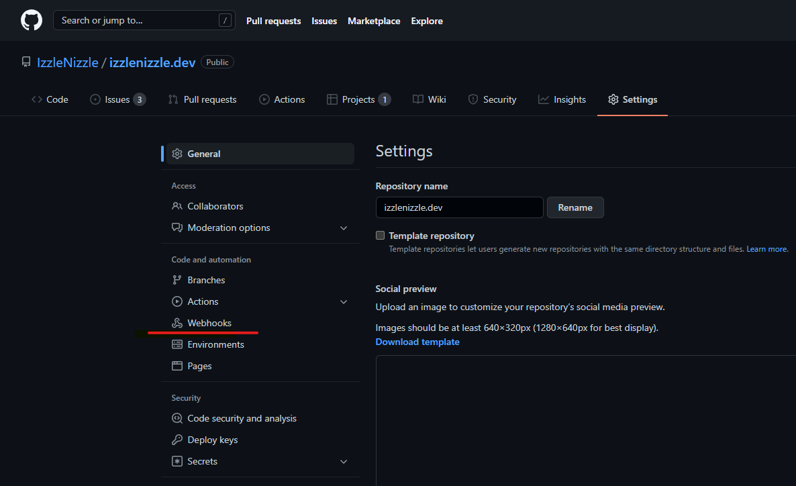
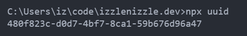

<a href="https://gist.github.com/IzzleNizzle/8fca6b164b00ba9f71c0418316ab0d6e" target="_blank">Here is the Gist</a>

When working on my personal coding projects, a major point of friction for going from coding to deployed has always been the process of updating whatever is hosting my code. CI/CD pipelines can be easily set up using a million available solutions, but sometimes I enjoy the satisfaction of getting my hands dirty and doing something mostly from scratch. 

For this example i have my code hosted on a VPS. This project hosts a Node.js + Express app that catches the webhook from Github, then fires a shell script that updates the codebase of various projects I have hosted on the server. I've included examples for a Gatsby project and the app itself which is managed by PM2.

To begin, you configure the webhook on your Github repo by going to the Settings tab, then Webhooks. Enter the address of where you are prepared to receive the POST request. Remember to change the `Content Type` to `application/json`. 

Enter in a secret if you wish to verify the call is coming from Github. You can generate a decent secret by using the `npx ucid` command in your terminal, assuming you have npm v5.2 or above.

Setting up the Express route and shell script is pretty straight forward. Github offers a security feature where you verify the call came from them. That took a bit of searching and tinkering to get correctly. That is handled in the main route, you can find the details in the `verifyPostData` method.

There are two environment variables you will need to provide. One for the Webhook secret, and one for the port you want this app to run on. 

You will need to customize the URL parameters you are listening for inside of the `updateCodebase` method. I've included two examples that I'm currently using, 

`"code_updater"` 

and 

`"izzlenizzle"`

Then update the shell scripts that run. The examples I've included are for a Gatsby project and a process managed by pm2, but feel free to change that to your needs. 

So this is ready to go.

1. Download these files
2. Install the dependancies with npm
3. Set environment variables
4. Update URL Parameters + Shell scripts
5. Let it rip.
